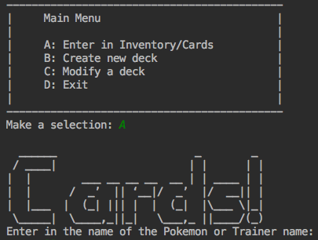
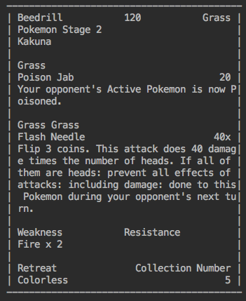
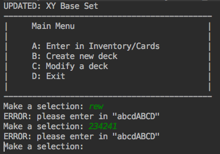
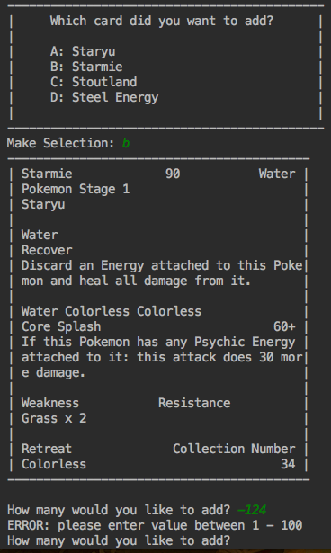
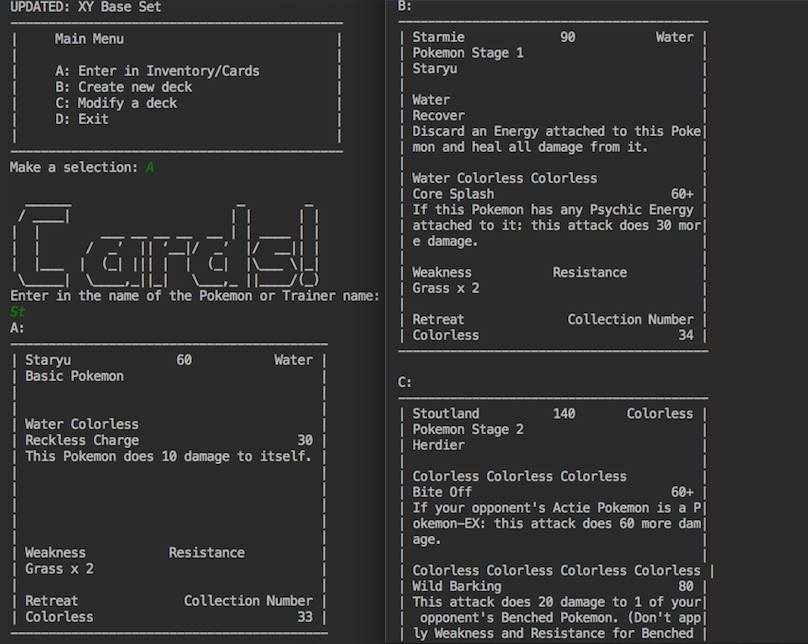
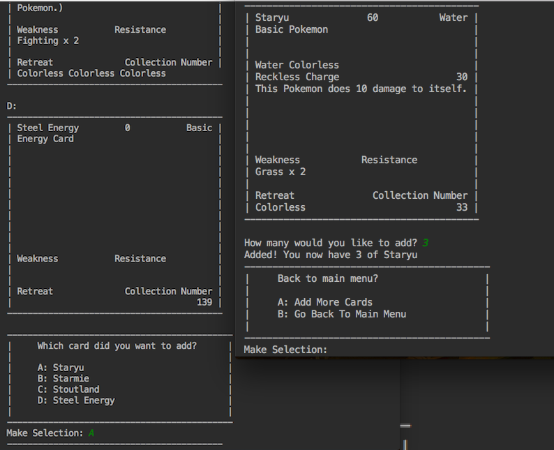

# SomeonesDeckBuilder
This project was created at the end of my Java I course. 
## Project Description

At the time, I was a part Pokemon League by my local trading card shop. 
The community was mostly middle and high school kids. I was often asked 
by new player’s parents to look at a box of Pokemon cards they have and 
create a deck for their child. This task is not simple and can be 
rather time consuming. The confusing part is figuring out which cards 
can be used in the current season.  I wanted to create a program to 
allow anyone to enter in which cards they have and create it will 
create a valid deck list for them.

## Features

#### Console Output - Formatted Output

  I created a visual output to allow users to be more engaged with the program.
  
- Menu

  
  
- Card
  
  

#### Console Input with Error Checking

  I accounted for user errors. 
  
- Error handling in menu selection

  
  
- Error handling in inventory
  
  
  
## Screenshots

  
  
  

